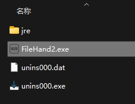

## FileHandler

1. 获取给定文件夹内，所有图片的`DPI`信息（使用*metadata-extractor*），根据给定阈值分组，写入aDpiList-date.txt文件。
2. 提取给定文件夹内所有的文件名，控制台打印。

## 安装
运行在没有安装JDK、JRE的小白的windows电脑？
1. 打包jar
2. exe4j：将jar转换成exe，
3. inno setup（windows）：将依赖和exe一起打成一个安装程序

不使用inno，可以exe4j配置JRE search sequence
目录`./jre`，将jre文件放在和.exe应用同级目录，一并发给对方。

